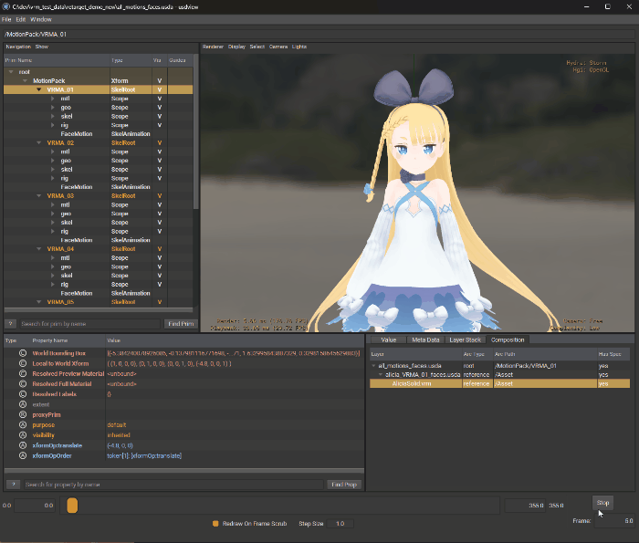

# OpenUSD VRM Avatar Plugins

[](https://github.com/animu-sphere/usd-vrm-plugins/actions/workflows/ost-source-ci.yml)
[](docs/reference/SUPPORTED_CONFIGURATIONS.md)
[](LICENSE)

**VRM / VRMA-specific integration with OpenUSD.**

<p align="center">
  
  <br>
  <p align="center"><i>A VRM scene loaded directly through the file-format plugin, with a VRMA motion file retargeted onto the avatar, previewed in usdview with Hydra Storm.</i></p>
</p>

## Scope

This repository owns what needs the [VRM](https://vrm.dev/en/) specification:

- `.vrm` import — VRM 0.x and 1.0, normalized into one canonical model and
  authored as a deterministic OpenUSD stage;
- `.vrma` import — VRM Animation clips as avatar-independent semantic motion;
- the VRM schemas, and resolution of resources embedded in a `.vrm`;
- VRM humanoid semantics on a rig — the humanoid binding, VRM 1.0's required
  bones, expressions and look-at;
- `execVrm`, VRM semantics as OpenExec computations.

It does not own:

| Subject | Owner |
| --- | --- |
| Generic motion: values, sampling, filtering, recording, retargeting, the OpenUSD motion mapping | [`usd-motion-plugins`](https://github.com/animu-sphere/usd-motion-plugins) |
| Live input: devices, protocols, source profiles, trackers | [`motion-connectors`](https://github.com/animu-sphere/motion-connectors) |
| Runtime composition and the update loop | `usd-avatar-runtime` |

The importers **author data and never evaluate or simulate it**. Evaluation
belongs to `execVrm` or to a runtime outside this repository.

## Architecture

```text
avatar.vrm ─▶ usdVrmFileFormat ─▶ /Asset  (skeleton, humanoid, expressions, look-at)
walk.vrma  ─▶ usdVrmaFileFormat ─▶ /Animation  (semantic humanoid clip)
                                        │
                       usd-motion-plugins: MotionClip, retarget
                                        │
             vrmRig: VRM binding, expressions, look-at
                                        │
            motion_retarget (bake)  ·  execVrm (OpenExec)
                                        ▼
                            UsdSkelAnimation on the avatar
```

`.vrm` and `.vrma` are separate plugins and compose by reference, never by
`subLayer` ([VRM motion policy](docs/design/VRM_MOTION_POLICY.md)).

## Components

| Component | Responsibility |
| --- | --- |
| [`vrmSchema`](plugins/vrmSchema) | VRM typed API schemas and the schema contract |
| [`usdVrmFileFormat`](plugins/usdVrmFileFormat) | `.vrm` parsing, canonicalization and USD authoring |
| [`usdVrmPackageResolver`](plugins/usdVrmPackageResolver) | Resolution of resources embedded in a `.vrm` |
| [`usdVrmaFileFormat`](plugins/usdVrmaFileFormat) | `.vrma` clips → a `UsdSkelAnimation` on a canonical semantic skeleton |
| [`execVrm`](plugins/execVrm) | VRM retarget computations for OpenExec over the applied `VrmHumanoidAPI` |
| [`vrmContainer`](libs/vrmContainer) | GLB parsing and byte-range validation, shared by the importer and the resolver |
| [`vrmRig`](libs/vrmRig) | What a VRM rig adds to the generic retarget: required bones, expression resolve, look-at |
| [`motion_retarget`](tools/motionRetarget) | CLI: bakes a semantic clip onto a VRM rig as `UsdSkelAnimation` |
| `usdVrm` | The aggregate product name — never a bundle id |

Identities and dependency directions:
[docs/architecture/WORKSPACE.md](docs/architecture/WORKSPACE.md).

## Documentation

| | |
| --- | --- |
| [What is implemented](docs/reference/CAPABILITY_MATRIX.md) | Per-feature status, for the importer and for motion on a VRM rig |
| [Supported configurations](docs/reference/SUPPORTED_CONFIGURATIONS.md) | Platforms, OpenUSD, build requirements |
| [Incomplete work](docs/roadmap/current.md) | The next release's open conditions |
| [Release history](CHANGELOG.md) | The changelog, and the per-version [release records](docs/releases/) |
| [docs/](docs/README.md) | Which document owns which subject |

## Build

Install a released product with [docs/guides/INSTALL.md](docs/guides/INSTALL.md).
To build from source, with [OpenStrata](https://github.com/animu-sphere/open-strata):

```sh
ost runtime pull cy2026 --profile usd --from-usd /path/to/openusd-install
ost plugin test --workspace
```

or with plain CMake against an OpenUSD 26.08 install and installed
`usd-motion-plugins` packages. Both paths, the test labels, CI and the release
lane are in [docs/guides/BUILDING.md](docs/guides/BUILDING.md).

## License

Original source and documentation: Apache-2.0 (see [LICENSE](LICENSE)).
Third-party components keep their own licenses; see
[THIRD_PARTY_NOTICES.md](THIRD_PARTY_NOTICES.md). cgltf v1.15 is vendored under
[`third_party/cgltf`](third_party/cgltf) with its MIT license. Contributions:
[CONTRIBUTING.md](CONTRIBUTING.md) · [Code of Conduct](CODE_OF_CONDUCT.md) ·
[Security Policy](SECURITY.md).

> Local test VRM avatars used during development are **not** part of this
> repository and are not redistributed here; mind their individual licenses.
